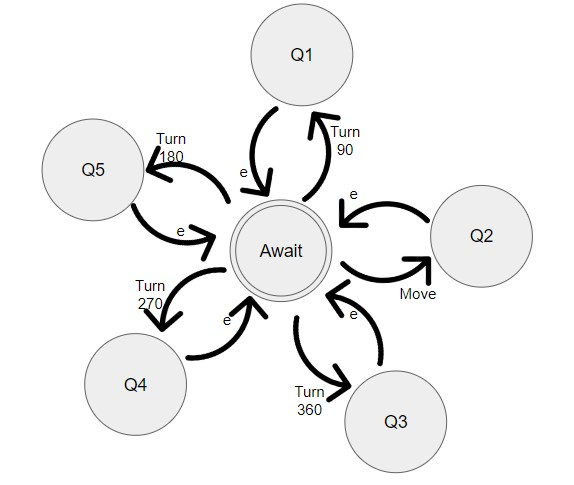

# My Little Robot

##### Link to the repository:
[https://github.com/juanjosalco/My_Little_Robot](https://github.com/juanjosalco/My_Little_Robot)
## Description
This is a simple robot that can move around a 10x10 grid. It can be placed on the grid, moved and rotated. 
The grammar provided allows the user to input a series of instructions for the robot to follow. These instructions can include movement and rotation commands. The grammar also includes rules for handling connectors and final connectors, allowing the user to chain together multiple instructions in a single program and have a more natural interaction with the robot.
By using the grammar, the user can create programs that control the robot's movements and report its position on the grid. This can be useful for a variety of applications, such as simulating the movement of a physical robot or testing algorithms for robot navigation.
The project will have a c++ code that simulates the CPU of a robot, which recieves instructions regarding its movement through an assembly file previously generated by the compiler.

## Tools

This project was implemented using the following tools:

- Flex: A lexical analyzer generator that was used to generate the scanner for the robot program. Flex is a tool that generates code for scanning input streams and is commonly used in the development of compilers and interpreters.

- Yacc (Bison): A parser generator that was used to generate the parser for the robot program. Yacc is a tool that generates code for parsing input streams and is commonly used in the development of compilers and interpreters.

- C++: This language was used to create the cpu and read instruction by instruction in the assembly file in order to print a matrix of 10x10 and the path the robot followed.

These tools were chosen because they are widely used in the development of compilers and interpreters, and are well-suited for implementing the grammar-based approach used in this project. Flex and Yacc were chosen because of their ease of use and ability to generate efficient code for scanning and parsing input streams.

## Context Free Grammar

Here are the accepted words for each token:
```text
⟨ROBOT⟩ → "robot" | "Robot" | "ROBOT"
⟨KIND_WORD⟩ → "please" | "kindly"
⟨ROTATION_VERB⟩ → "rotate" | "turn"
⟨DEG_QUANTITY⟩ → 90 | 180 | 270 | 360
⟨DEGREES⟩ → "degrees"
⟨MOVEMENT_VERB⟩ → "move" | "go"
⟨DISTANCE⟩ → [1-9][0-9]*
⟨UNITS⟩ → "steps" | "units"
⟨COMMA⟩ → ","
⟨NEXO⟩ → "next" | "then" | "afterwards" | "after" | "and"
⟨FINAL_CONNECTOR⟩ → "finally" | "lastly" | "last"
⟨TO⟩ → "to"
⟨THE⟩ → "the"
⟨RIGHT⟩ → "right"
⟨LEFT⟩ → "left"
⟨FRONT⟩ → "front" | "forward"
⟨BACK⟩ → "back"
⟨BACKWARDS⟩ → "backwards"
⟨CLOCKWISE⟩ → "clockwise"
⟨COUNTERCLOCKWISE⟩ → "counterclockwise"
```

Here is the context free grammar used to parse the input:
```text
⟨S⟩ → ⟨ROBOT⟩ ⟨INSTRUCTION⟩
⟨INSTRUCTION⟩ → ⟨DO⟩ ⟨CONNECTOR⟩ | ⟨DO⟩
⟨DO⟩ → ⟨KIND_WORD⟩ ⟨ACTION⟩ | ⟨ACTION⟩
⟨ACTION⟩ → ⟨ROTATION⟩ | ⟨MOVEMENT⟩ ⟨DIR⟩
⟨ROTATION⟩ → ⟨ROTATION_VERB⟩ ⟨DEG_QUANTITY⟩ ⟨CLK⟩ | ⟨ROTATION_VERB⟩ ⟨DEG_QUANTITY⟩ ⟨DEGREES⟩ | ⟨ROTATION_VERB⟩ ⟨DIR⟩
⟨CLK⟩ → ⟨DEGREES⟩ ⟨CLOCKWISE⟩ | ⟨DEGREES⟩ ⟨COUNTERCLOCKWISE⟩ | ⟨DEGREES⟩ ⟨RIGHT⟩ | ⟨DEGREES⟩ ⟨LEFT⟩
⟨MOVEMENT⟩ → ⟨MOVEMENT_VERB⟩ ⟨DISTANCE⟩ ⟨UNITS⟩
⟨DIR⟩ → ⟨ORIENTATION_1⟩ | ⟨TO⟩ ⟨THE⟩ ⟨ORIENTATION_1⟩
⟨ORIENTATION_1⟩ → ⟨RIGHT⟩ | ⟨LEFT⟩ | ⟨FRONT⟩ | ⟨BACK⟩ | ⟨BACKWARDS⟩
⟨CONNECTOR⟩ → ⟨COMMA⟩ ⟨NEXO⟩ ⟨INSTRUCTION⟩ | ⟨COMMA⟩ ⟨INSTRUCTION⟩ | ⟨COMMA⟩ ⟨FINAL_CONNECTOR⟩ ⟨DO⟩
```

The rotations are considered to be always counterclockwise, that's why the grammar is able to identify when the user wants to rotate clockwise and it transforms the rotation to its equivalent counterclockwise rotation, making the interaction with the robot more natural.

The grammar also allows the user to chain together multiple instructions in a single program and have a more natural interaction with the robot.

## Input and Output

- Input: The input language code is provided in the `input.txt` file.
- Output: The Yacc code generates an output file named `output.asm` located in the `../cpu/src/` directory. This file contains instructions or messages based on the parsed input code.

## Parsing Process

The Yacc code follows a standard parsing process to analyze the input code. Here's an overview of the steps involved:

1. The `main()` function serves as the entry point of the program. It opens the input file, sets up file pointers, and prepares the output file.
2. The `yyparse()` function is called to initiate the parsing process.
3. The Yacc parser calls the Lex code (lexer) using the `yylex()` function to obtain tokens for each input symbol.
4. The lexer processes the input, identifies patterns, and generates tokens based on the lexical rules defined in `robot.l`.
5. The Yacc parser processes the tokens according to the grammar rules and associated actions defined in `robot.y`.
6. During the parsing process, the Yacc actions manipulate the output file by opening it, writing specific content (instructions or messages), and closing it.
7. If a parsing error occurs, the `yyerror()` function is called to handle the error. It writes an error message to the output file and displays the error on the console.
8. Once the parsing is complete, the output file is closed, and the program terminates.

## Error Handling

- If an error occurs during the parsing process, the `yyerror()` function is called. It writes an error message to the output file and displays the error on the console.
- The error message provides information about the nature of the error and helps identify the issue in the input code.

Some inputs that are rejected by the grammar are if you use unexpected words, for example:
```text
robot please rotate 90 degrees to the right and then jump 5 steps forward
```
In this example `jump` is not a valid word so it will raise an error of an unexpected token.

Another example is if you use a word that is not in the correct order, for example:
```text
robot please rotate 90 degrees to the right and then to the left move 5 units forward
```
In this example `to the left` is not in the correct order, so it will raise syntax error and parsing error.

### Accepted Input Examples
**Input 1**
```text
robot please rotate 90 degrees to the right and then move 5 steps forward
```

**Output 1**
```text
TURN, 270
MOV, 5
```

**Input 2**
```text
Robot please turn 90 degrees to the right, then move 5 units to the right, then move 10 steps, next move 15 units to the back, then move 5 steps backwards, finally turn 180 degrees
```

**Output 2**
```text
TURN, 270
TURN, 270
MOV, 5
MOV, 10
TURN, 180
MOV, 15
TURN, 180
MOV, 5
TURN, 180
```

## Installation

To run the compiler, you can follow these steps:

1. Clone the repository to your local machine and navigate to the project directory:
```bash
git clone https://github.com/juanjosalco/My_Little_Robot.git
cd My_Little_Robot
```

2. Run the makefile to compile the lex and yacc files and generate the executable using the Makefile.

```bash
make compile
```

# Machine state and CPU simulator
A C++ code will serve as the Robot CPU, which will read a file containing a set of valid instructions line by line, to then perform the corresponding instruction as long as it fits within the accepted area. The C++ code will then display in the terminal a 10x10 space, as well as the staring and ending point of the robot.

In case any given invalid instruction is read, the code will exit displaying an error. This also applies in case an instruction causes the robot to cross the accepted area.
```c++
void checkLimits(int value){
    if (currentDirection == "moveRight" && currentPositionX + value > 10){
        cout << "! INVALID MOVE !" << endl;
        exit(-1);
    }
    else if (currentDirection == "moveLeft" && currentPositionX - value < 0){
        cout << "! INVALID MOVE !" << endl;
        exit(-1);
    }
    else if (currentDirection == "moveDown" && currentPositionY + value > 10){
        cout << "! INVALID MOVE !" << endl;
        exit(-1);
    }
    else if (currentDirection == "moveUp" && currentPositionY - value < 0){
        cout << "! INVALID MOVE !" << endl;
        exit(-1);
    }
}
```
This code detects if the movement the robot is about to perform lies within the limits before it actually performs it. If the limits will be trespased, the CPU will send a message of an invalid move, and stop running.

```c++
void instructionSelected(string inst, int val){
   if(inst == "MOV,"){
       checkLimits(val);
       moveRobot(val);
   } else if(inst == "TURN,"){
       setDirection(val);
   } else {
       cout << "\n! INVALID INSTRUCTION !" << endl;
       exit(-1);
   }
}
```
This section of the CPU code is in charge of detecting the inctruction read from the Assembly File, and executes it depending on the type of command (Move or Turn). If the instruction is other than both of the valid commands, the CPU will send an Invalid Instruction message, and stop running.


## Robot CPU NFA Diagram


# Test Automation

The file test contains a Python script for automating tests for the MyLittleRobot program. It allows you to define a set of input instructions and their expected outputs, and then runs the program with each input and compares the output to the expected result.

## Prerequisites

Make sure you have the following installed:

- Python (version 3 or above)
- `make` command (used for compilation)

## Instructions

1. Navigate to the repository directory.
2. Open the `test.py` file in a text editor.
3. Modify the `input_instructions_list` and `expected_output_list` variables according to your test cases.

## Running the Tests

To run the tests, follow these steps:

1. Open a terminal or command prompt.
2. Navigate to the repository directory.
3. Run the following command to execute the script:

   ```bash
   python3 test.py
   ```

4. The script will compile and run the program for each input instruction and compare the output to the expected result.
5. After all tests have been executed, the test results will be displayed in the terminal.

## Test Results

The test results will be shown in the terminal after running the script. Each test will be marked as either "PASS" or "FAIL" along with the corresponding test number.

Example test results:

```
Test Results:
✅ Test 1: PASS
✅ Test 2: PASS
❌ Test 3: FAIL
✅ Test 4: PASS
❌ Test 5: FAIL
✅ Test 6: PASS
✅ Test 7: PASS
```

## Cleanup

The script will automatically remove the `result.txt` file generated during the tests.

Please note that this script assumes the presence of a `makefile` in the parent directory for compilation and running the program. Make sure the makefile is properly configured for your program before running the tests.

Feel free to modify the script as needed for your specific testing requirements.
