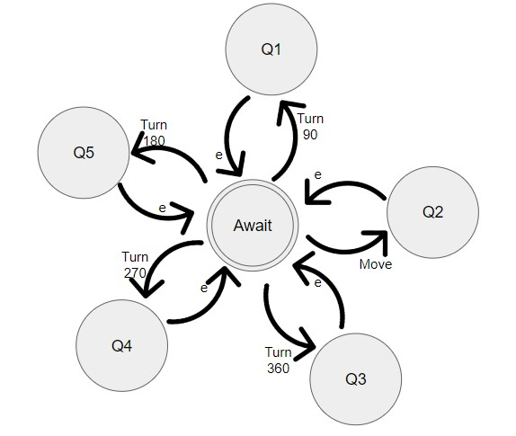

# Machine state and CPU simulator

##### Authors:
- Armando Terrazas Gómez | A01640924
- Fernando Gómez Martínez | A01641228
- Juan José Salazar Cortés | A01642126
- Mariana Esquivel Hernández | A01641244

## Description of the problem
This project simulates the CPU of a robot, which recieves instructions regarding its movement through an assembly file previously generated by the compiler.

For the project, a C++ code will serve as the Robot CPU, which will read a file containing a set of valid instructions line by line, to then perform the corresponding instruction as long as it fits within the accepted area. The C++ code will then display in the terminal a 10x10 space, as well as the staring and ending point of the robot.

In case any given invalid instruction is read, the code will exit displaying an error. This also applies in case an instruction causes the robot to cross the accepted area.
```c++
void checkLimits(int value){
    if (currentDirection == "moveRight" && currentPositionX + value > 10){
        cout << "! INVALID MOVE !" << endl;
        exit(-1);
    }
    else if (currentDirection == "moveLeft" && currentPositionX - value < 0){
        cout << "! INVALID MOVE !" << endl;
        exit(-1);
    }
    else if (currentDirection == "moveDown" && currentPositionY + value > 10){
        cout << "! INVALID MOVE !" << endl;
        exit(-1);
    }
    else if (currentDirection == "moveUp" && currentPositionY - value < 0){
        cout << "! INVALID MOVE !" << endl;
        exit(-1);
    }
}
```
This code detects if the movement the robot is about to perform lies within the limits before it actually performs it. If the limits will be trespased, the CPU will send a message of an invalid move, and stop running.

```c++
void instructionSelected(string inst, int val){
   if(inst == "MOV,"){
       checkLimits(val);
       moveRobot(val);
   } else if(inst == "TURN,"){
       setDirection(val);
   } else {
       cout << "\n! INVALID INSTRUCTION !" << endl;
       exit(-1);
   }
}
```
This section of the CPU code is in charge of detecting the inctruction read from the Assembly File, and executes it depending on the type of command (Move or Turn). If the instruction is other than both of the valid commands, the CPU will send an Invalid Instruction message, and stop running.


## Robot CPU NFA Diagram


[Link to the source code](https://github.com/juanjosalco/My_Little_Robot)
